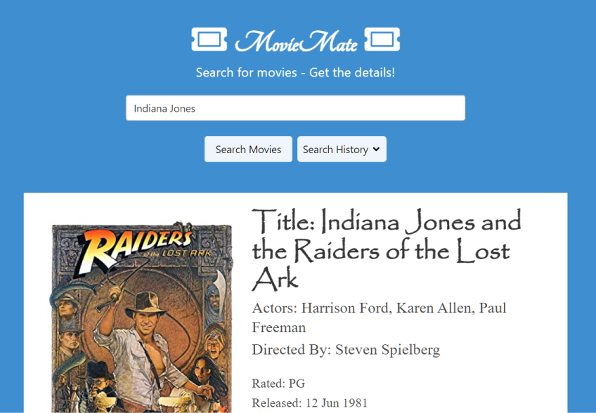

# movie-mate
Search movies and find out more about them.

## Description
MovieMate pulls general movie information and movie trailers based on user searches.

This project was a test of various skills:
- Adapting to new CSS Frameworks (In this case: Bulma)
- Dynamic JavaScript
- localMemory functions
- Google's Youtube API
- oMDB API
- Manipulating multiple APIs through a single search

It has the following features:
- Allows user to search for a movie, pulling  OMDB movie data and a youtube movie trailer.
- Stores past searches in an easily accessible drop-down panel.
    - History results are clickable, and pull the movie data again.
- Clears local memory with a button click.
- Design is responsive and adapts to mobile as well as desktop views.

## Installation
N/A

## Usage

See the published site: [here](https://stevengoldbergm.github.io/movie-mate/)
- To use the app, simply click into the search field and enter the title of the movie you wish to know more about.
    - The movie's title, actors, directors, rating, release date, and IMDB review score will be displayed during the search, along with the genre, writers, and plot.
    - A movie trailer, pulled from Youtube, will be embedded in the bottom of the screen.
    - NOTE: Some embedded Youtube videos will not play outside of Youtube. If your results pull such a video, click the "Watch on Youtube" link to view the associated trailer.
- You can review old search results by hovering over the "Search History" drop-down menu, and selecting a previous search.
- If you wish to reset MovieMate, click the "Clear History" button inside the "Search History" drop-down menu to remove all local storage from your device.

## License
N/A